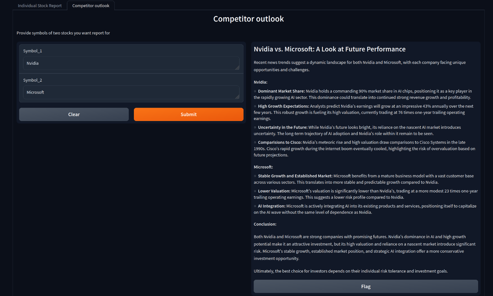

# FinRAG

Financial RAG is a retrieval augmented generation implementation using llama index for stock trend analysis using money control news data. LLMs can perform logical reasoning but they lack the latest research or trends. If we somehow provide them with the context they need they can perform tasks much better.  


## Details & Explanation

1) We first load our own data here we are scraping money control recent news articles into text files
2) We load a embedding model from huggingface 
3) Once we have text data we load it and generate vector embeddings
4) Finally a query engine is created using indexed documents and llm here we are using google's gemma model which is inferenced on groq 


## Installation

Clone the repo

```bash
git clone https://github.com/jashjasani/FinRAG.git
```

Open directory
```bash
cd FinRAG
```
Create virtual environment

```bash
python -m venv venv
```

Activate environment 

```bash
source venv/bin/activate
```

Install requirements

```bash
pip install -r requirements.txt
```
Start app 
```bash
python app.py
```

## Screenshots




